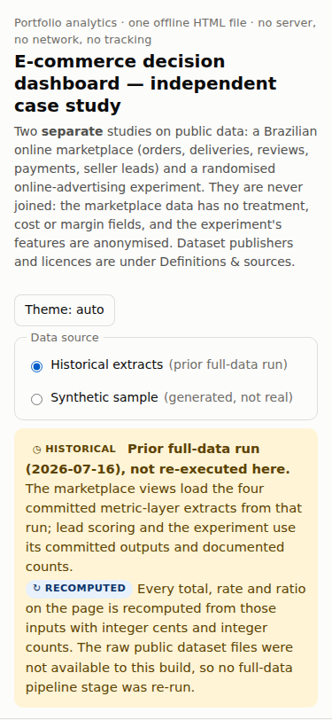

# E-commerce Decision Analytics

[](https://github.com/herui03/ecommerce-decision-analytics/actions/workflows/ci.yml)

An online marketplace wants to know four things:

- where deliveries run late;
- where freight eats into order value;
- whether a lead score helps sales prioritise;
- whether an ad campaign lifted conversions.

This project answers those questions with a single offline HTML dashboard built on a tested dbt + DuckDB
pipeline. For any selected months, the dashboard recomputes each KPI in the browser and shows its numerator and
denominator. When the source data cannot support a figure, it is marked unavailable. It is an independent case
study on two public datasets, a Brazilian e-commerce marketplace and a randomised online-advertising experiment,
which are analysed separately and never joined.

**[Open the dashboard](dashboard/decision-dashboard.html)** (download and open in any browser) ·
**[Overview with screenshots](docs/HR_OVERVIEW.md)** · **[3-minute demo](docs/demo-3min.md)**


## What the dashboard does

- **Eight views:** Overview, Categories, States, Payments, Lead scoring, Experiment, Definitions & sources,
  and Decision memo.
- **Filters:** a month range with presets. The category, state and payment filters apply only to their own
  view, because no extract has a joint month × state × category grain.
- **Traceable numbers:** each KPI shows how it is calculated, and each chart can switch to a table.
- **Two data sources:** it switches between historical extracts from public data and a generated sample.
- **Break-even calculator** for the ad campaign, using cost and value figures you enter.
- **Runs anywhere:** one file of about 0.9 MB, with no server. Its Content-Security-Policy blocks all network
  requests. It supports keyboard navigation, light and dark themes, and phone-width screens.

| View | Question | How the number is built |
|---|---|---|
| Overview | How did the marketplace perform in the selected months? | Rates sum numerators and denominators across months before dividing |
| Categories | Where is item GMV concentrated, and how large is freight's share? | Item grain; an order spanning two categories counts in both, so category order counts are not added up |
| States | How do customer states compare on GMV, freight and delivery? | Average order value only where its denominator can be recovered uniquely; multi-month state late rates unavailable in the historical extract |
| Payments | Which primary payment method do orders use, and how common are instalments? | "Payments on these orders" is the whole order total, not the amount paid by that method |
| Lead scoring | Can a score help sales prioritise? | Label-maturity and look-ahead checks; top-k hit counts that account for tied scores |
| Experiment | Did the campaign lift conversions, and what would it need to be worth? | Intention-to-treat effect with a 95% confidence interval, plus a break-even calculator |
| Definitions & sources | What does each number mean and where does it come from? | Metric dictionary, licences, per-month reconciliation, input hashes |
| Decision memo | What should happen next? | Investigations and experiments to run ([`docs/decision-memo.md`](docs/decision-memo.md)) |

## Example: late-delivery rate

For January 2017 to August 2018, 6,532 of 96,211 delivered orders arrived late: **6.79%**. Averaging the
20 monthly rates instead gives 5.89%, because it weights January 2017 (750 delivered orders) the same as
November 2017 (7,289). The dashboard always sums late and delivered orders across the selected months before
dividing.

| Lead scoring | Experiment | Phone width |
|---|---|---|
|  |  |  |

## Run it yourself

Viewing the dashboard needs no installation. To rebuild it, use **Python 3.11 or 3.12** (tested on Linux)
with the pinned `requirements.txt`. Python 3.13 and 3.14 are refused with a clear message, because numpy 2.0.2
and scikit-learn 1.6.1 have no wheels for them. On macOS, install one with `brew install python@3.12` or
`uv python install 3.12`.

```bash
git clone https://github.com/herui03/ecommerce-decision-analytics.git
cd ecommerce-decision-analytics

scripts/setup.sh          # .venv with Python 3.12/3.11 + pinned packages (PYTHON=python3.12 to choose)
make sample               # synthetic data -> dbt build (171 nodes: 28 models + 143 data tests) -> extracts -> models -> dashboard (~20 s)
make verify               # committed dashboard and generated docs == a fresh build, byte for byte
make test-fast            # unit, contract, artifact, lead, experiment and engine tests (~10 s)
make test                 # adds the dbt mutation tests and a full pipeline reproduction (~2 min)
make browser              # drives the dashboard in Chromium; writes docs/evidence/browser/
```

`make sample` needs no Kaggle account, no API key and no network. It regenerates `sample/` and the
dashboard, and `git status` stays clean because the outputs are deterministic.

**Full-data path (optional, not run here).**

1. Download the three Kaggle datasets into `data/raw/` (see the source manifest).
2. Build the `dev` target: `cd dbt && DBT_PROFILES_DIR=$PWD ../.venv/bin/dbt build`.
3. Run `python/criteo/ab_analysis.py`.

The singular tests tagged `full_data` pin the earlier run's counts. They will show whether the reconstructed
intermediate layer reproduces them.

## How it is built

```
Kaggle CSVs (not committed)      synthetic generator (seeded)
          \                      /
       dbt + DuckDB: 11 staging -> 5 intermediate (reconstructed) -> 12 marts
                        |  generic tests + data-agnostic invariants (+ full_data pins)
          metric extracts (month / month×category / month×state / month×type)
                        |
   python/portfolio: contract (integer cents, per-month reconciliation, bounded inference)
                     leads (as-of windows, point-in-time features, tie-aware top-k)
                     experiment (ITT, CACE, MDE, break-even)
                        |
   dashboard/decision-dashboard.html  (engine.js recomputes every selection in the browser)
```

Stack: SQL, dbt-core 1.10, DuckDB 1.4, Python (pandas, scikit-learn, statsmodels), vanilla JavaScript/SVG,
Playwright, GitHub Actions.

## Analysis decisions

| Plan | What the data showed | Decision |
|---|---|---|
| RFM segmentation | 96.88% of customers ordered once (historical), so frequency is constant | Dropped the frequency axis and the cohort module ([01](docs/challenge-01-rfm-frequency-collapse.md)) |
| Ad lift on exposed users | Naive exposed vs control reports +2,675.83% against an ITT relative lift of +59.45% | Intention-to-treat for decisions; exposure used only as an instrument ([02](docs/challenge-02-exposure-trap.md)) |
| One join across order children | Payments inflate 26% and 1,525 orders vanish (historical measurement) | Pre-aggregate to order grain; assert row counts and money ([03](docs/challenge-03-silent-fanout.md)) |
| Chart the full date range | A pilot period and an export tail create false growth and collapse | Explicit window, January 2017 to August 2018 ([04](docs/challenge-04-phantom-trend.md)) |
| Lead scoring on all leads | Zero 90-day conversions for the Jul–Oct 2017 cohorts; cause unknown | Restricted window; labels, features and ties re-examined ([05](docs/challenge-05-target-measured-the-org.md)) |
| Combine monthly averages | Extracts store per-month means, not the counts behind them | Exact combination only when a sum and count exist; otherwise "unavailable" |

## Documents

| Document | Contents |
|---|---|
| [`docs/HR_OVERVIEW.md`](docs/HR_OVERVIEW.md) | Short overview with results, skills, screenshots and a 3-minute demo |
| [`docs/decision-memo.md`](docs/decision-memo.md) | Recommendations, with every number generated from the inputs |
| [`docs/metric-dictionary.md`](docs/metric-dictionary.md) | Numerators, denominators and grain for every metric, and how selections combine |
| [`docs/source-manifest.md`](docs/source-manifest.md) | Data sources, licences, and what is in the repository |
| [`docs/evidence.md`](docs/evidence.md) | What was executed, with logs; what is historical; what could not run |
| [`docs/defect-log.md`](docs/defect-log.md) | Defects found and fixed, with before/after evidence |
| [`docs/demo-3min.md`](docs/demo-3min.md) | Three-minute walkthrough script |
| [`docs/learning-guide-zh.md`](docs/learning-guide-zh.md) | 学习指南（中文）：七个核心概念、亲手复现练习、术语表 |
| [`docs/data-verification.md`](docs/data-verification.md) | Verification log of the earlier full-data run (historical) |

## Data, scope and limits

**What data is in the repository**

| Source | Kind | Status |
|---|---|---|
| Four marketplace metric extracts (month, month × category, month × state, month × payment type) | Aggregates of public data | Committed by an earlier full-data run (2026-07-16) on the Olist datasets. Every total, rate and ratio is recomputed from them here with integer cents and counts; the run itself was not re-executed. |
| 2,655 held-out marketplace leads with model scores | Row-level public data (the dataset's anonymised lead IDs) | From the same earlier run. AUC, PR-AUC and Brier recompute exactly. Shown as a retrospective backtest: the training labels were not complete at the original cut, one feature used later leads (look-ahead), and the top-decile hit count depends on tied scores. |
| Ad-experiment arm counts | Six aggregate counts from the Criteo dataset | Documented by the earlier run. One is inferred as the only integer consistent with a documented rate. The 13.98 M-row file was not re-read. |
| Synthetic sample | Generated (regions `XA`–`XH`, categories `synthetic_cat_*`) | Deterministic. It runs through the real dbt project from a clean clone and describes no real business. |

**Provenance limits**

- The raw public files could not be downloaded in the build environment. The historical extracts and lead
  scores have therefore not been compared row by row with the source datasets.
- Five intermediate dbt models missing from the original project were reconstructed. They have been
  validated on the synthetic sample only; there has been no full-data re-run.
- Figures from the earlier run that are not recomputed here are kept as history in
  [`docs/data-verification.md`](docs/data-verification.md). They include 99,441 source orders,
  13,979,592 experiment rows, and 170 passing dbt nodes, a count that includes the 28 models.

**Analysis limits**

- The marketplace data has no treatment, cost or margin fields, so no causal, A/B or ROI claims are made
  about it.
- The ad-experiment features are anonymised (`f0`–`f11`) and are not given product or geography meaning.
- The historical state extract lacks delivered and late counts, and the counts behind its averages. Several
  multi-month state and average metrics are therefore shown as unavailable rather than approximated.
- The corrected lead-scoring design trains on about one month of mature labels at the real dates, and it has
  been run only on synthetic data. The outcome-observation cutoff (wins recorded through 2018-08-29) is an
  assumption.

**Validation**

- **dbt:** the synthetic build runs 171 nodes (28 models + 143 data tests).
- **Tests:**
  - 108 Python tests. Among them, the dbt mutation tests catch 6 of 6 injected defects.
  - 9 JavaScript engine tests.
  - A Chromium end-to-end run (13 tests, 74 checks) that compares displayed numbers with a separate
    reference implementation.
- **Reproducibility:** rebuilds are byte-identical, and CI runs on Python 3.11 and 3.12. Logs are in
  [`docs/evidence.md`](docs/evidence.md).

## Licence and data attribution

Code: MIT ([`LICENSE`](LICENSE)).

Data sources:

- The Brazilian E-Commerce Public Dataset by Olist and the Marketing Funnel by Olist (CC BY-NC-SA 4.0).
- The Criteo Uplift Modeling Dataset (Criteo AI Lab); only six aggregate counts are used.

Olist-derived data in this repository (extracts, lead scores, dashboard payload) is shared under
CC BY-NC-SA 4.0, attribution Olist, non-commercial. See [`docs/source-manifest.md`](docs/source-manifest.md).

Herui Dou, MSc Business Analytics, NTU. [LinkedIn](https://www.linkedin.com/in/heruidou)
