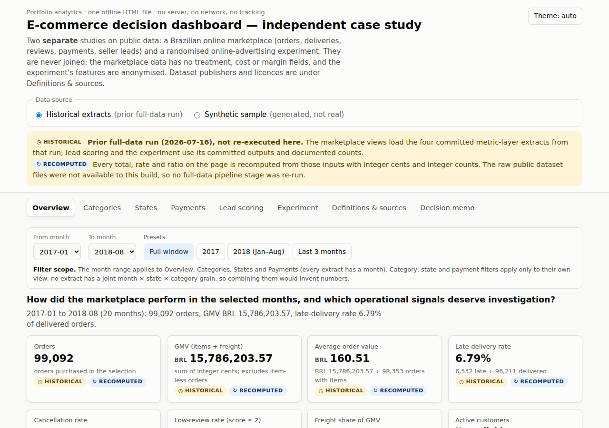
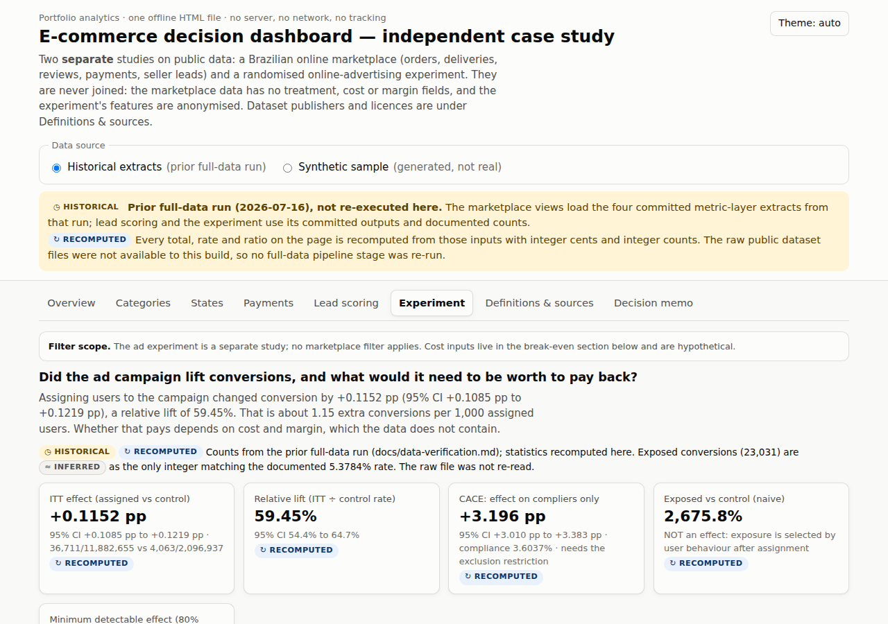
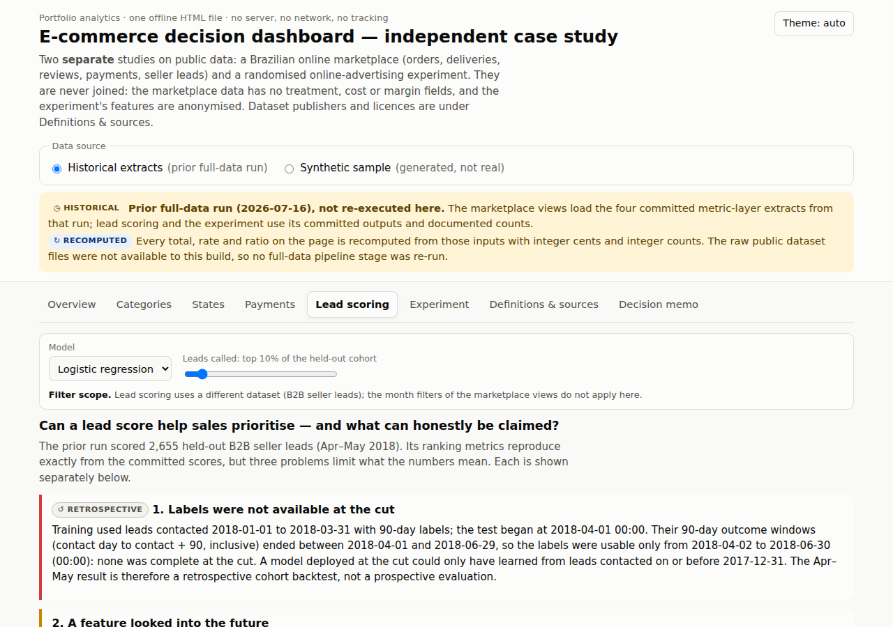
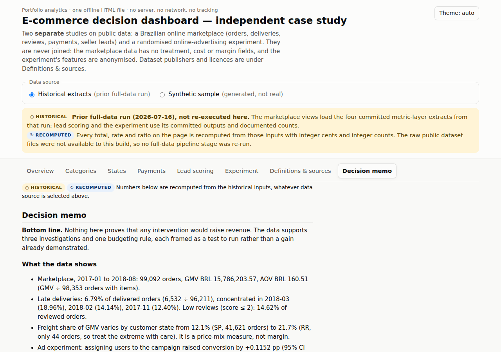

# E-commerce Decision Analytics — overview

An online marketplace needs to know four things: where deliveries run late, where freight eats into order value,
whether a lead score helps sales prioritise, and whether an ad campaign lifted conversions. This project answers
those questions in a single offline HTML dashboard.

- **Marketplace metrics** are recomputed for the selected months wherever the data supports it. Each is shown
  with its numerator and denominator, and figures the data cannot support are marked unavailable.
- **Lead scoring and the experiment** have their own scope: a held-out lead cohort and the experiment's two arms.

It is an independent case study made of two separate studies on public data: one of a Brazilian e-commerce
marketplace (orders and seller leads) and one of a randomised online-advertising experiment.

**[Open the dashboard](../dashboard/decision-dashboard.html)** (download and open in any browser) ·
**[3-minute demo script](demo-3min.md)** · **[README and setup](../README.md)**

## Example: late-delivery rate

From January 2017 to August 2018, 6,532 of 96,211 delivered orders arrived late: **6.79%**. Averaging the
20 monthly rates would give 5.89%, because it weights a month with 750 delivered orders the same as one with
7,289. The dashboard sums late and delivered orders across the selected months before dividing.

## Other results

- **Ad campaign:** assigning users to the campaign raised conversion by **0.115 percentage points** (95% CI
  0.108–0.122), about 1.15 extra conversions per 1,000 users. Comparing exposed users with the control group
  gives +2,676%, which reflects selection bias rather than the campaign's effect.
- **Lead scoring:** this is a retrospective backtest (AUC 0.687). It measures ranking quality, not extra sales,
  and the analysis corrects immature training labels, a look-ahead feature and hit counts that depended on
  tied scores.

## Stack and methods

- **SQL, dbt and DuckDB:** a layered warehouse with declared grain, plus data tests that catch join
  fan-out and money leaks.
- **Python (pandas, scikit-learn, statsmodels):** intention-to-treat analysis with confidence intervals,
  minimum detectable effect, and point-in-time features for lead scoring.
- **Dashboard:** a dependency-free JavaScript and SVG page with table alternatives, keyboard access and a
  strict Content-Security-Policy.
- **Reproducibility:** deterministic synthetic data, and CI on Python 3.11 and 3.12 that includes Chromium
  browser tests.

## Demo

The [3-minute demo script](demo-3min.md) walks through the overview, the filters, lead scoring, the experiment
and the decision memo.

| Experiment | Lead scoring | Decision memo |
|---|---|---|
|  |  |  |

## Data and limits

- **Historical inputs:** the marketplace figures are recomputed from aggregate extracts, and the lead results
  from 2,655 held-out lead records. Both were committed by an earlier full-data run on the public Olist
  datasets.
  - That run was not re-executed.
  - The raw files were not re-downloaded, so these inputs have not been compared row by row with the source
    data.
- **Experiment:** it uses six aggregate counts from the Criteo dataset.
- **Synthetic sample:** a generated sample runs the full pipeline in about 20 seconds; it describes no real
  business. Five reconstructed dbt models have been validated on this sample only.
- **No causal or ROI claims** are made about the marketplace, because its data has no cost, margin or
  randomised treatment.

Details, validation counts and setup are in the [README](../README.md#data-scope-and-limits).

## Sources and licences

- The Brazilian E-Commerce Public Dataset by Olist and the Marketing Funnel by Olist, under CC BY-NC-SA 4.0
  (attribution Olist, non-commercial).
- The Criteo Uplift Modeling Dataset (Criteo AI Lab).

See [`docs/source-manifest.md`](source-manifest.md). Code is MIT-licensed.

Herui Dou, MSc Business Analytics, NTU. [LinkedIn](https://www.linkedin.com/in/heruidou)
